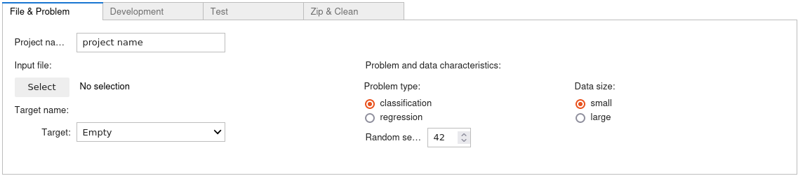
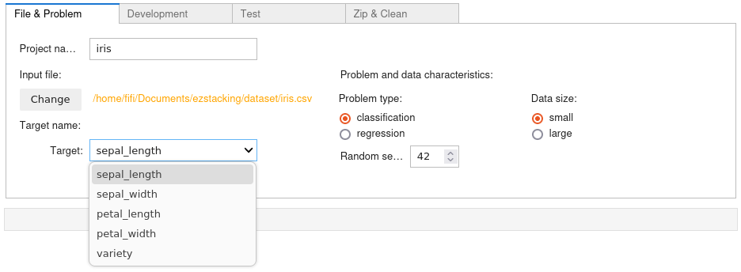
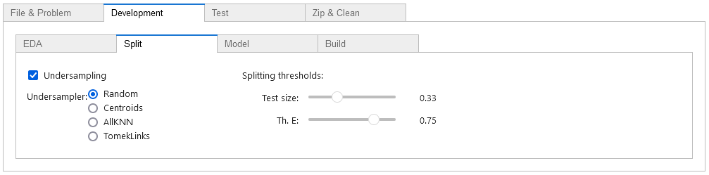
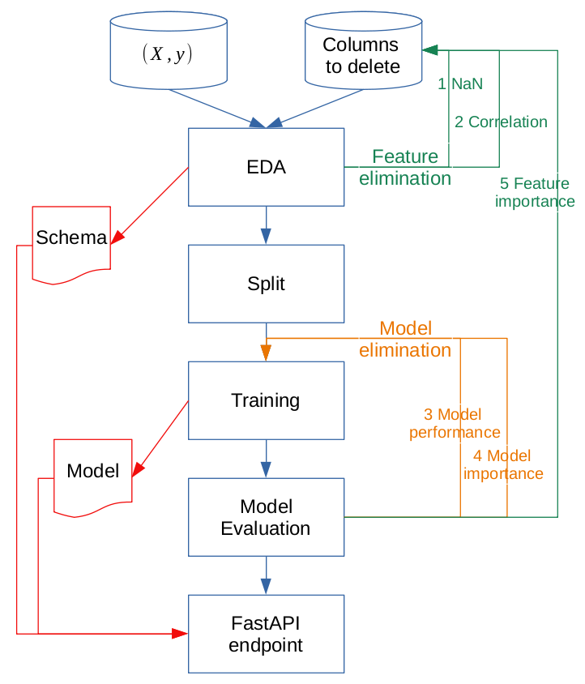
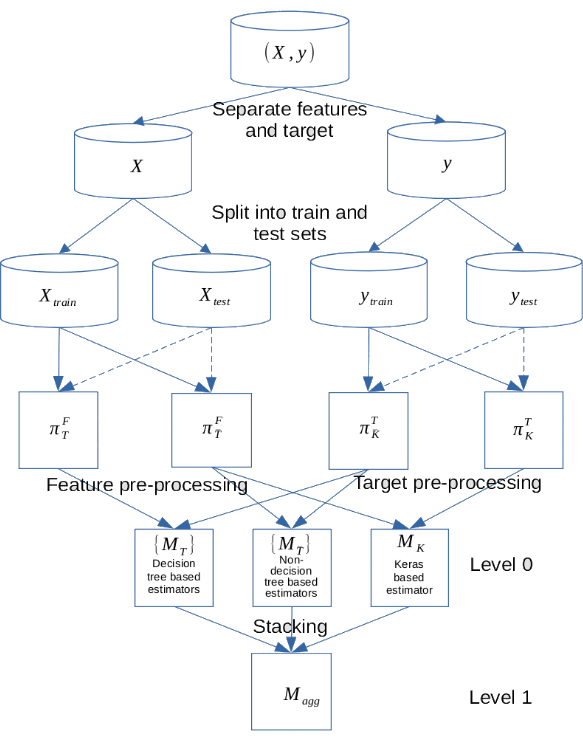

<h1 style="text-align: center;">EzStacking: from data to Kubernetes thru Scikit-Learn, Keras, FastAPI and Docker</h1>

# Theoretical preamble
## Learning algorithm
Tom Mitchell provides the following definition of a **learning program** : “A computer program is said to **learn** from **experience $E$** with respect to some class of **tasks $T$** and **performance measure $P$**, if its performance at tasks in $T$, as measured by $P$, improves with experience $E$.”

The algorithm associated to this learning program is called a **learning algorithm**.

## Supervised learning problems
Let's assume that there is a function $f:U\subset \mathbb{R}^{n}\rightarrow V\subset \mathbb{R}^{p}$, $f$ is unknown and is called the **parent function** or the **objective function**, $U$ is the **input space**, $V$ is the **output space**. For the sake of simplicity, let's assume that $p=1$.

The only thing we know about $f$ is a set of samples $L=\lbrace\left(x_i, y_i\left(=f\left(x_i\right)\right)\right)\in U\times V\rbrace_{i\in \lbrace 1,..,I \rbrace}$, $x$ are called **features**, $y$ the **target** and $L$ the **learning set**.

We would like to find an approximation $\tilde{f}$ of $f$ built from the learning set and a learning algorithm, this is a **supervised learning problem**.

Here, the experience $E$ is the learning set, the task is to find the function $\tilde{f}$ and the performance measure is the gap between the prediction and the ground truth (i.e. the target $y_{i}$ in the learning set). 

### Regression / Classification
If $V$ is **continuous** (resp. **discrete**) in the preceding definition, then it is a **regression** (resp. **classification**) problem.

### Time series forecasting
Let's imagine an experiment during which a result $X_{t}$ is measured over time, $\lbrace X_{t}\rbrace_{t}$ is a **time series**. How can we predict $X_{t+\tau}$ (where $\tau$ is the time step)? 

Let's assume that $X_{t+\tau}$ depends on the $k$ preceding measures ($k$ is the **window size** or **lag number**), we can suppose that there is a function $f$ such that: $X_{t+\tau}=f \left(X_{t}, X_{t-\tau},.., X_{t-k\tau} \right)$.

Let's define $L=\lbrace\left(X_{t} ,X_{t-\tau},.., X_{t-k\tau},X_{t+\tau} \right)\rbrace_{t}$, that is typically a regression learning set.

## Useful operators
### Feature and target extractors
Let's say we have a learning set $L=\lbrace \left( x, y \right)  \in U \times V \rbrace$, the **feature extractor** $\pi_{f}$ is defined by $\pi_{f}\left(L\right)=\lbrace x, \left( x, y \right)  \in L \rbrace$, the **target extractor** $\pi_{t}$ is defined by $\pi_{t}\left(L\right)=\lbrace y, \left( x, y \right)  \in L \rbrace$.

### Training operator
The **training operator** $T$ is the operator that transforms a learning algorithm into a **model** (or **estimator**) fitted on a learning set. 
Let $A$ be a learning algorithm and a learning set $L$, $M^{A}_{L}=T\left(A,L \right)$ is the model obtained after training $A$ on $L$.

During the training process, the learning set $L$ is divided into a training set $L_{train}$ and a test set $L_{test}$, and the algorithm $A$ is trained on the training set (i.e. optimised so that the gap between the prediction and the ground truth is minimal). A function $S$ called **score** measures the gap mean.

$S_{train}=S\left(M^{A}\_{L_{train}}\left(\pi_{f}\left(L_{train}\right) \right),\pi_{t}\left(L_{train}\right) \right)$ is the **train error**, $S_{test}=S\left(M^{A}\_{L_{train}}\left(\pi_{f}\left(L_{test}\right) \right),\pi_{t}\left(L_{test}\right) \right)$ is the **test error**. 

## Folding and cross-validation
Let's say we have a learning set $L=\lbrace\left(x_{i}, y_{i}\right)\in U\times V\rbrace_{i\in \lbrace 1,..,I\rbrace}$ (it is assumed that $I$ is not prime), $J$ is a divisor of $I$. It is possible to split (**randomly** for **regression** and **classfication** problems, but for **time series** forecasting, the **temporal order** must be **respected**) $L$ into $J$ equal (and usually disjoint) parts $\lbrace L_{j}\rbrace_{j\in \lbrace 1,..,J\rbrace}$.

$L_{j}$ is the **test set** and $L^{\hat{\jmath}}=L-L_{j}$ is the **train set** for the $j$th **fold** of the **$J$ fold cross-validation**.

Some properties:
* If $J==I$:
   * $L_{i}\neq L_{j}$, if $i\neq j$ 
   * $\bigcup_{i} L_{i}=L$
   * as there is only one element in each test set, this technique is suitable for small amount of data.

* If $J|I$:  
   * $\sharp L^{\hat{\jmath}}=\frac{I}{J}$ 
   * $L^{\hat{\imath}} \cap L^{\hat{\jmath}}=\emptyset$, if $i\neq j$ 
   * $\bigcup_{i} L^{\hat{\jmath}}=L$
   * this technique is suitable for large amount of data.

$T$ is the training operator, invoking the learning algorithm $A$ on the training set $L^{\hat{\jmath}}$ induces a model $M^{\hat{\jmath}}_{A}=T\left(A,L^{\hat{\jmath}}\right)$. 

The [cross-validation](https://scikit-learn.org/stable/modules/cross_validation.html) error (or **cross-validation score**) is given by:
$$S_{CV}\left(M_{A},L\right)=\frac{1}{J}\sum_{j=1}^{J}\delta\left(M^{\hat{\jmath}}\_{A_{j}}\left(\pi_{f}\left(L_{j}\right)\right)-\pi_{t}\left(L_{j}\right) \right) $$ where $\delta$ measures the gap between prediction of $M^{\hat{\jmath}}\_{A_{j}}$ and ground truth. 

Ideally, $S_{train}$ should be closed to $S_{CV}$; if $S_{train}$ is closed to $S_{CV}$ and $S_{train}$ is large, the model suffers from **underfitting** (the model has **large biais**); if $S_{train}$ is small and $S_{CV}$ is largely greater than $S_{train}$, the model suffers from **overfitting** (the model has **large variance**)   

The technique of **minimal cross-validation error** says that given a set of candidate learning algorithms $\lbrace A_{k}\rbrace_{k \in \lbrace 1,..,K\rbrace}$ and a learning set $L$, one should generalize from $L$ with a model $M_{l}=T\left(A_{l},L\right) \in \lbrace T\left(A_{k},L\right)\rbrace_{k \in \lbrace 1,..,K\rbrace}$ such that $S_{CV}\left(M_{l},L\right) \lt S_{CV}\left(M_{j},L\right)$, $\forall j \ne l$. 

### Stacked generalization
Let $\lbrace A_{k}\rbrace_{k \in \lbrace 1,..,K\rbrace}$ be a finite set of learning algorithm.
We can define a finite set of models $\lbrace M\_{k}^{\hat{\jmath}}\rbrace\_{k \in \lbrace 1,..,K\rbrace}$, where $M^{\hat{\jmath}}\_{k}=T\left(A_{k},L^{\hat{\jmath}}\right)$, they are called the **level 0 models**.

Let's define $z_{nk}=M^{\hat{\jmath}}\_{k}\left( x_n \right)$ for all $x_n \in \pi_{f}\left(L_{j}\right)$.

At the end of the entire cross-validation process, the dataset assembled from the outputs of the $K$ models is: $L_{CV}=\lbrace\left(z_{1i},..,z_{Ki}, y_i\right)\rbrace_{i\in \lbrace 1,..,I\rbrace}$.

Let $\bar A$ be another learning algorithm, $\bar M=T\left(\bar A,L_{CV}\right)$, $\bar M$ is called the **level 1 model**.

The level 0 models are retrained on the whole learning set $\lbrace M_{k}\rbrace_{k \in \lbrace 1,..,K\rbrace}=\lbrace T\left(A_{k},L\right)\rbrace_{k \in \lbrace 1,..,K\rbrace}$, and finally $\tilde{f}=\bar M\left( M_{1},..,M_{K} \right)$, which is the **stacked model**.

## Questioning
### Wolpert's black art 
In his paper on classification and stacked generalization, D. Wolpert underlines 3 points:
 * no rules saying what level 0 learning algorithms one should use
 * no rules saying what level 1 learning algorithms one should use
 * how to choose the number of level 0 learning algorithms.
 
### Model importance
#### Regression
In his paper on regression and stacked generalization, L. Breiman indicates that if a linear regression is used as level 1 learning algorithm, a non-negativity constraint on the coefficients must be added.

#### Classification
In their paper, K. M. Ting and I. H. Witten explain that, for classification, the level 1 learning algorithm should be a multi-response least-squares regression based on class probabilities (confidence measure), but no non-negativity constraint is needed. 

However, the non-negativity constraint increases the interpretability, and these coefficients can be used to define the **model importance** of the level 0 models. 

### Model selection
So, if the initial set of level 0 learning algorithms is large enough, it can be shrinked according to the model importances (moreover, the train and test scores must also be considered, to avoid underfitting and overfitting), this is the **model selection**. 

# Introduction
EzStacking is a [**development tool**](#ezstacking---as-development-tool) designed to adress **supervised learning** problems. It can be viewed like an extension of the idea proposed in the article [No Free Lunch:Free at Last!](https://www.researchgate.net/publication/341233408_No_Free_LunchFree_at_Last).

EzStacking handles **classification**, **regression** and **time series forecasting** problems for **structured data** (_cf. Notes hereafter_) using **stacked generalization**, that is an ensemble learning approach that trains a **level 1 model** to integrate the predictions of multiple **level 0 models**, with the aim of generating more robust and precise predictions than any of the individual base models.

Sometimes, the stacked models can be heavy, slow or not accurate, they can contain bad level 0 models or some features have bad influence on score, EzStacking allows the **final model** to be **optimised** along three axes:
- the number of **level 0 models** (reduced using model importance)
- the number of **features** (reduced using feature importance)
- the **complexity** (depth) of the level 0 models (depending on the user's choices).

The main principles used in EzStacking are also presented in these two articles:
- [Model stacking to improve prediction and variable importance robustness for soft sensor development](https://www.sciencedirect.com/science/article/pii/S2772508122000254) Maxwell Barton, Barry Lennox - Digital Chemical Engineering Volume 3, June 2022
- [Stacking with Neural network for Cryptocurrency investment](https://arxiv.org/pdf/1902.07855v1.pdf) Avinash Barnwal, Haripad Bharti, Aasim Ali, and Vishal Singh - Inncretech Inc., Princeton, February 2019.

_Notes:_ 
* _the **time series forecasting** problem is based on the **transformation** of **time series** to **supervised learning problem**_
* _EzStacking **must** be used with *.csv dataset using separator ','_  
* _the column names **must not** contain spaces (otherwise it will produce error during server generation)_
* _for the **time series** forecasting, one of the columns in the dataset must be a **temporal value**._

The **development process** produces:
* a development notebook (generated by a **[Jupyter notebook](https://jupyter.org/) generator** based on  [**Scikit-Learn pipelines**](https://scikit-learn.org/stable/modules/compose.html#combining-estimators) and [**stacked generalization**](https://scikit-learn.org/stable/modules/ensemble.html#stacking)) containing: 
  * an [**exploratory data analysis (EDA)**](#data-quality--eda) used to assess data quality
  * a [**modeling**](#modeling) [building](#build) a reduced-size stacked estimator, including at each step an evaluation and an inspection of the model
* a [**server**](#serving-the-model) (with its client) returning a prediction, a measure of the quality of input data and the execution time
* a [**test generator**](#test) that can be used to evaluate server performance
* a [**Docker container generator**](#docker) that contains all the necessary files to build the final Docker container based on FastAPI and uvicorn, and a file for the deployment of the API in Kubernetes
* a [**zip package**](#zip--clean) containing all the files produced during the process.

### Some results
I spent some time on [Kaggle](https://www.kaggle.com/philippebillet/code), some results about the optimisation process described here are given in this site, moreover and analysis of the results can be found [here](https://www.kaggle.com/code/philippebillet/stacking-importances-result-analysis). 
I became Nobebooks Master with this project.

Time has passed and EzStacking continues to evolve, some full projects (in zip format) can be found in the `examples` folder on [GitHub](https://github.com/phbillet/EzStacking).

# EzStacking - How to install it
First you have to:
* install [**Anaconda**](https://anaconda.org/) 
* create the **virtual environment** EzStacking using the following command: `conda env create -f ezstacking.yaml`
* **activate** the virtual environment using the following command: `conda activate ezstacking`
* **install kernel** in ipython using the following command: `ipython kernel install --user --name=ezstacking`
* launch the **Jupyter server** using the following command: `jupyter-lab --no-browser`

_Notes:_
* `jupyter-lab` _is a comfortable development tool more flexible than_ `jupyter notebook`
* _sometimes,_ `jupyter-lab` _uses a lot of ressources (the kernel is running even if the work is finished), it is certainly due to_ `varInspector` _, you can inactivate it using the command_ `jupyter nbextension disable varInspector/main`.

### How to uninstall it
You simply have to: 
* **deactivate** the virtual environment using the following command: `conda deactivate`
* **remove the virtual environment** using the following command: `conda remove --name ezstacking --all`  
* **remove the kernel** using the following command: `jupyter kernelspec uninstall ezstacking`

# EzStacking - How to use it

## Input file and problem characteristics

In Jupyter, first open the notebook named `ezstacking.ipynb`:

Then click on `Run All Cells`:

First select your **file**, then select the **target** name (_i.e._ the variable on which we want to make predictions), the **problem type** (_i.e._ **classification** if the target is **discrete**, **regression** if the target is **continous**, if the problem is **time dependent**, the **time indexing column** and the **lag number** must be filled) and the **data size**:

_Notes:_ 
* _the data size is **small**, if the number of row is smaller than **3000**_
* _the **lag number** is the number of past observations used to train the model_
* _**Random seed** is used for **replicability**._
## Development
Now, let's choose the options:

### EDA

#### Visualization options
|Option                                                | Notes                                                               |
|------------------------------------------------------|---------------------------------------------------------------------|
|[Yellow bricks](https://www.scikit-yb.org/en/latest/) | The graphics will be constructed with Matplotlib and Yellow bricks  |
|[Seaborn](https://seaborn.pydata.org/)                | The graphics will be constructed with Matplotlib and Seaborn        |
|[fastEDA](https://github.com/Matt-OP/fasteda)         | The graphics will be constructed with Matplotlib and fastEDA        |
|[ydata-profiling ](https://github.com/Matt-OP/fasteda)| The graphics will be constructed with Matplotlib and ydata-profiling|

_Notes:_
* _**time-dependent** problems benefit from **specific interactive visualization tools** based on [**statmodels**](https://www.statsmodels.org/stable/index.html):_
  - _**autocorrelation** and **partial autocorrelation**_
  
  
  - _**seasonal decomposition** with **one period**_
  
  
  - _**seasonal decomposition** with **two periods**_
  
  
  - _**unobserved components decomposition**_
  
  
  
  
* _the visualisation option Seaborn can produce time consuming graphics._

#### Thresholds in EDA

_Notes:_
* _threshold_cat: if the **number of different values** in a column is less than this number, the column will be considered as a **categorical column**_
* _threshold_NaN: if the proportion of **NaN** is greater than this number the column will be **dropped**_
* _threshold_Z: if the **Z_score**  (indicating **outliers**) is greater than this number, the rows will be **dropped**._

### Splitting

_Notes:_
* _test size: **proportion** of the dataset to include in the test split_
* _threshold_E: if **target entropy** is greater than this number, **[RepeatedStratifiedKFold](https://scikit-learn.org/stable/modules/cross_validation.html#repeated-k-fold)** will be used._
* _if the option **Undersampling** is checked, then an [undersampler](https://imbalanced-learn.org/stable/references/under_sampling.html) must be chosen with care._

### Modeling
 

|Model	|Data size | |Model |Data size |
|------|----------|-|------|----------|
|[Gradient Boosting](https://scikit-learn.org/stable/modules/ensemble.html#id36)	|both | |[SGD](https://scikit-learn.org/stable/modules/linear_model.html#stochastic-gradient-descent-sgd)	|both |
|[Support vector](https://scikit-learn.org/stable/modules/svm.html)	|small | |[Logistic Regression](https://scikit-learn.org/stable/modules/linear_model.html#logistic-regression)	|both |
|[Keras](https://keras.io/guides/)	|both | |[Linear Regression](https://scikit-learn.org/stable/modules/linear_model.html#ordinary-least-squares)	|both |
|[Gaussian Process](https://scikit-learn.org/stable/modules/gaussian_process.html)	|small | |[ElasticNet](https://scikit-learn.org/stable/modules/linear_model.html#elastic-net) |both |
|[Decision Tree](https://scikit-learn.org/stable/modules/tree.html)	|small | |[Multilayer Perceptron](https://scikit-learn.org/stable/modules/neural_networks_supervised.html)	|small |
|[Random Forest](https://scikit-learn.org/stable/modules/ensemble.html#forests-of-randomized-trees) |both | |[KNeighbors](https://scikit-learn.org/stable/modules/neighbors.html) |small |
|[AdaBoost](https://scikit-learn.org/stable/modules/ensemble.html#adaboost)	|both | |[Gaussian Naive Bayes](https://scikit-learn.org/stable/modules/naive_bayes.html)	|small     |
|[Histogram-based Gradient Boosting](https://scikit-learn.org/stable/modules/ensemble.html#histogram-based-gradient-boosting)|both |

_Notes:_
* _if the option "**No correlation**" is checked, the model will not integrate decorrelation step_
* _if the option "**No model optimization**" is checked, the number of models and of features will not be reduced automatically_
* _if **no estimator** is selected, the **regressions** (resp. **classifications**) will use **linear regressions** (resp. **logistic regressions**)_
* _depending on the **data size**, EzStacking uses the estimators given in the preceding table for the level 0_
* _estimators based on **Keras** or on **Histogram-Based Gradient Boosting** benefit from [**early stopping**](https://en.wikipedia.org/wiki/Early_stopping), those based on gaussian processes do not benefit from it_
* _the Gaussian methodes option is only available for small dataset._ 

_**Known bugs** using Keras:_
* _for **classification problems**: the generated **API doesn't work** with Keras_
* _the **ReduceLROnPlateau** callback produces an error when **saving the model**._

#### Level 1 model options
|Level 1 model type              | Notes                                        |
|--------------------------------|----------------------------------------------|
|Regression (linear or logistic) |the option `Non-negativity` should be checked |
|Decision tree                   |alternative approach to the importance        |

#### Thresholds in modeling

_Notes:_
* _threshold_corr: if the **correlation** is greater than this number the column will be **dropped**_
* _threshold_score:  **keep** models having **test score** greater than this number._
* _threshold_model: **keep** this number of **best models** (in the sens of **model importance**)_
* _threshold_feature: **keep** this number of **most important features**_

### Build
Simply enter a file name:

Just click on the button , you should find **your notebook** in the **current folder** (otherwise a Python error will be emitted).

Then open the notebook, and click on the button `Run All Cells`.

## Test

You just have to fill the numbers of (passing and non-passing) tests. Then click on the button , it will generate the file `test.sh`.

Now, at the bottom of the generated notebook, click on the link .

It opens the server notebook, then execute the line `run server.py` (and check carfully if the server is well started). If you have chosen the link http://127.0.0.1:8000/docs it opens the classical test gui of FastAPI.

If you have clicked on the link [client](client), it opens the client notebook and you just have to execute the first command, the result should look like the following:

## Docker

[**Docker Desktop**](https://www.docker.com/products/docker-desktop/) is the tool used for this part.

The last step of the main notebook is the generation of all the useful files used to build the Docker container associated with the model.

These files are stored in a folder having the name of the project.

Open a terminal in this folder and launch the following command to **build** the container:
* `docker build -t <project_name> .`

The container can be **run** directly in Docker Desktop, you can also use the following command line:
* `docker run --rm -p 80:80 <project_name>`

_**Note**:_ 
* _**Models using Keras** will **not work** due to technical problem with SciKeras_

### Kubernetes
The program also generates a file for the API deployment in Kubernetes:

**Deployment** in Kubernetes:
* `kubectl apply -f <project_name>_deployment.yaml`

**Control** the deployment of the service:
* `kubectl get svc`

**Delete** the service:
* `kubectl delete -f <project_name>_deployment.yaml`

_**Note**:_ 
* _The generated test script can be used with both Docker and kubernetes._
* _If the container is **running in Docker**, it must be **stopped** before **testing** it in **Kubernetes**._

## Zip & Clean

If you click on the button , EzStacking generates a zip archive file containing:
* the initial dataset
* the developement notebook
* the model
* the data schema
* the client and the server
* a generic notebook to test FastAPI endpoint.

Further more, it also suppresses from the folder the elements added to the archive, the **files generated for the Docker container** are **simply deleted** (it is assumed that the container had been built in Docker). 

_Note: it is advisable to close properly the generated notebooks (`Ctrl + Shift + Q`)._

# EzStacking - As development tool
## Development process
Once the first notebook has been generated, the development process can be launched.

You simply have to follows the following workflow:

Fortunately, if the option "**No model optimization**" is not checked in the modeling step, the entire process is automated, you just have to fix the thresholds and choose your models.

## Data quality & EDA
EDA can be seen as a **toolbox** to evaluate **data quality** like: 
* dataframe **statistics**
* **cleaning** _i.e._ **NaN** and **outlier** dropping
* ranking / **correlation** 

_Note: the EDA step **doest not** modify data, it just indicates which actions should be done._

This process returns:
* a **data schema** _i.e._ a description of the input data with data type and associated domain: 
  * minimum and maximum for **continous features**, 
  * a list for **categorical features**
* a list of columns `dropped_cols` that should be **suppressed** (simply adding at the departure of the EDA this list to the variable `user_drop_cols`, then it is necessary to **re-launch** from the EDA). 

_Notes:_
* _Tip: starting with the end of the EDA is a good idea (`Run All Above Selected Cell`), so you do not execute unnecessary code (at the first step of development)_
* _[Yellow Brick](https://www.scikit-yb.org) offers different graphs associated to ranking and correlation and many more informations_
* _The main steps of data **pre-processing**:_
  1. _not all estimators support **NaN** : they must be corrected using **iterative imputation** (resp. **simple imputation**) for numerical features (resp. categorical features)._
  2. _data **normalization** and **encoding** are also key points for successful learning_ 
  3. _only the **correlations** with the target are interesting, the others must be removed (for linear algebra reasons)_
* _Those steps are implemented in the first part of the **modeling pipeline**._

## Modeling
### Model construction

The **first step** of modeling is structured as follow:

During the splitting step: 
* if the dataset is large, the test set should be reduced to 10% of the whole dataset
* imbalanced classes are measured using [Shannon entropy](https://stats.stackexchange.com/questions/239973/a-general-measure-of-data-set-imbalance), if the score is too low, the splitting is realized using [RepeatedStratifiedKFold](https://scikit-learn.org/stable/modules/cross_validation.html#repeated-k-fold).

_Note: for **imbalanced class management**, EZStacking also offers different **subsampling methods** as an option._

This initial model is maybe too large, the modeling process **reduces** its size in terms of **models** and **features** as follow:
1. the set of **estimators** is reduced according to the **test scores** and the **importance** of each level 0 model

|Regression train and test scores  |  Classification train and test scores |
|-------------------------|-------------------------|
|  |  |

|Regression model importance  |  Classification model importance |
|-------------------------|-------------------------|
|  |  |

2. the stack based on the reduced estimator set is trained 
3. the **feature importance** graphic indicates which columns could also be **dropped**

|Regression feature importance  |  Classification feature importance |
|-------------------------|-------------------------|
|  |  |

4. those columns are added to the variable `dropped_cols` depending on the value of `threshold_feature`
5. `dropped_cols` can be added to `user_drop_cols` at the departure of the EDA (then it is necessary to **re-launch** from the EDA).

_Notes:_ 
* _the calculation of the **model importance** is based on the coefficients of the regularized linear regression used as level 1 estimator_
* _the **feature importance** is computed using [permutation importance](https://scikit-learn.org/stable/modules/permutation_importance.html)_
* _it is important not to be too stingy, it is not necessary to remove too many estimators and features, as this can lead to a decrease in performance._

### Model evaluation

#### (Class) prediction error
Regression |  Classification
:-------------------------:|:-------------------------:
  |  

Time series forecasting |
:-------------------------:|
  |

#### Specific to classification (with Yellow Brick option)
##### ROC/AUC 

##### Classification report

##### Confusion matrix

#### Specific to regression (with Yellow Brick option)
##### Residuals plot

### Model inspection

#### Model importance

#### Feature permutation importance

#### Partial Dependence & Individual Conditional Expectation
Regression |  Classification
:-------------------------:|:-------------------------:
  |  

## Serving the model
EzStacking also generates an API based on [**FastAPI**](https://fastapi.tiangolo.com/).

The complete **development process** produces three objects:
* a **schema**
* a **model**
* a **server** source.

They can be used as basic **prediction service** returning:
* a **prediction** 
* a list of columns in **error** (_i.e._ the value does not belong to the domain given in the schema)
* the elapsed and CPU **times**.

Example: 
Regression with data drift |  Classification without data drift
:-------------------------:|:-------------------------:
  |  

## Testing the model
The **schema** is also used to build the file of **passing** and **non-passing tests**, indeed a passing test (resp. a non-passing test) means that all features belong to their domains given in the schema (resp. at least one feature does not belong to its domain).

As we have already seen, the server returns the consumption of each request, in the test phase we also have access to the **global consumption** linked to the execution of all requests.

A test file for **Docker** (and **Kubernetes**) is also created, it is located in the directory associated with the Docker container.

# Resources used for this project:
* Stacking, Model importance and Others
  * [Machine Learning](http://www.cs.cmu.edu/~tom/files/MachineLearningTomMitchell.pdf), Tom Mitchell, McGraw Hill, 1997
  * [Stacked generalization](https://www.sciencedirect.com/science/article/abs/pii/S0893608005800231), David H. Wolpert, Neural Networks, Volume 5, Issue 2, 1992, Pages 241-259
  * [Stacked regressions](https://statistics.berkeley.edu/sites/default/files/tech-reports/367.pdf), Leo Breiman
  * [Issues in Stacked Generalization](https://arxiv.org/pdf/1105.5466.pdf), K. M. Ting, I. H. Witten
  * [No Free Lunch:Free at Last!](https://www.researchgate.net/publication/341233408_No_Free_LunchFree_at_Last), Ali Almashhadani, Neelang Parghi, Weihao Bi, Raman Kannan
  * [Model stacking to improve prediction and variable importance robustness for soft sensor development](https://www.sciencedirect.com/science/article/pii/S2772508122000254), Maxwell Barton, Barry Lennox - Digital Chemical Engineering Volume 3, June 2022, 100034
  * [Stacking with Neural network for Cryptocurrency investment](https://arxiv.org/pdf/1902.07855v1.pdf), Avinash Barnwal, Haripad Bharti, Aasim Ali, and Vishal Singh - Inncretech Inc., Princeton
  * [Gaussian Processes for Machine Learning](http://gaussianprocess.org/gpml/chapters/RW.pdf), Carl Eduard Rasmussen and Christopher K.I. Williams MIT Press 2006
  * [The Kernel Cookbook](https://www.cs.toronto.edu/~duvenaud/cookbook/), David Duvenaud
  * [Time series](http://ethen8181.github.io/machine-learning/time_series/3_supervised_time_series.html), MingYu (Ethen) Liu
  * ...
* Machine learning tools
  * [scikit-learn](https://scikit-learn.org/stable/)
  * [pandas](https://pandas.pydata.org/)
  * [keras](https://keras.io/)
  * [seaborn](https://seaborn.pydata.org/)
  * [statsmodels](https://www.statsmodels.org)
  * [YData Profiling](https://docs.profiling.ydata.ai/latest/)
  * ...
* Good ressources to learn Python and machine learning (those I used...)
  * [Python courses](https://youtu.be/82KLS2C_gNQ) (in French), Guillaume Saint-Cirgue
  * [Machine learning](https://www.coursera.org/learn/machine-learning), Andrew Ng & Stanford University
  * [Deep Learning Specialization](https://www.deeplearning.ai/program/deep-learning-specialization/), Andrew Ng & DeepLearning.ai
  * [Machine Learning Engineering for Production](https://www.coursera.org/specializations/machine-learning-engineering-for-production-mlops), Andrew Ng & DeepLearning.ai
  * [Machine Learning Mastery](https://machinelearningmastery.com/), Jason Brownlee
  * ...
