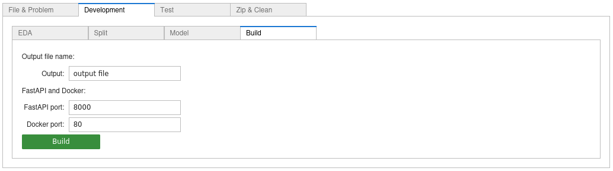

# EZStacking
EZStacking is a [**development tool**](#ezstacking---as-development-tool) designed to adress [**supervised learning**](https://en.wikipedia.org/wiki/Supervised_learning) problems. 

EZStacking handles **classification** and **regression** problems for **structured data** (_cf. Notes hereafter_). 

EZStacking allows the **final model** to be **optimised** along three axes:
- the number of **features**
- the number of **level 0 models**
- the **complexity** (depth) of the level 0 models.

The **development process** produces:
* a development notebook (generated by a **[Jupyter notebook](https://jupyter.org/) generator** based [**Scikit-Learn pipelines**](https://scikit-learn.org/stable/modules/compose.html#combining-estimators) and [**stacked generalization**](https://scikit-learn.org/stable/modules/ensemble.html#stacking)) containing: 
  * an [**exploratory data analysis (EDA)**](#data-quality--eda) used to assess data quality
  * a [**modelling**](#modelling) [building](#build) a reduced-size stacked estimator   
* a [**server**](#serving-the-model) (with its client) returning a prediction, a measure of the quality of input data and the execution time
* a [**test generator**](#test) that can be used to evaluate server performance
* a [**zip package**](#zip--clean) containing all the files produced during the process.

_Notes:_ 
* _EZStacking **must** be used with *.csv dataset using separator ','_  
* _the column names **must not** contain spaces (otherwise it will produce error during server generation)._

# EZStacking - How to install it
First you have to:
* install [**Anaconda**](https://anaconda.org/) 
* create the **virtual environment** EZStacking using the following command: `conda env create -f EZStacking.yaml`
* **activate** the virtual environment using the following command: `conda activate EZStacking`
* **install kernel** in ipython using the following command: `ipython kernel install --user --name=ezstacking`
* launch the **Jupyter server** using the following command: `jupyter-lab --no-browser`

_Note: `jupyter-lab` is a comfortable development tool more flexible than `jupyter notebook`._  

# EZStacking - How to use it

## Input file and problem characteristics

In Jupyter, first open the notebook named `EZStacking.ipynb`:

Then click on `Run All Cells`:

First select your **file**, fill the **target** name (_i.e._ the variable on which we want to make predictions), the **problem type** (_i.e._ **classification** if the target is discrete, **regression** otherwise) and the **data size**:

_Notes:_ 
* _the data size is **small**, if the number of row is smaller than **3000**._
* _depending on the data size, EZStacking uses those estimators for the level 0:_

|Model	|Data size | |Model |Data size |
|------|----------|-|------|----------|
|[XGBoost](https://arxiv.org/abs/1603.02754)	|both | |[SGD](https://scikit-learn.org/stable/modules/linear_model.html#stochastic-gradient-descent-sgd)	|large |
|[Support vector](https://scikit-learn.org/stable/modules/svm.html)	|large | |[Logistic Regression](https://scikit-learn.org/stable/modules/linear_model.html#logistic-regression)	|small |
|[Keras](https://keras.io/guides/)	|both | |[Linear Regression](https://scikit-learn.org/stable/modules/linear_model.html#ordinary-least-squares)	|small |
|[Gaussian Process](https://scikit-learn.org/stable/modules/gaussian_process.html)	|small | |[ElasticNet](https://scikit-learn.org/stable/modules/linear_model.html#elastic-net) |both |
|[Decision Tree](https://scikit-learn.org/stable/modules/tree.html)	|small | |[Multilayer Perceptron](https://scikit-learn.org/stable/modules/neural_networks_supervised.html)	|small |
|[Random Forest](https://scikit-learn.org/stable/modules/ensemble.html#forests-of-randomized-trees) |both | |[KNeighbors](https://scikit-learn.org/stable/modules/neighbors.html) |small |
|[AdaBoost](https://scikit-learn.org/stable/modules/ensemble.html#adaboost)	|both | |[Gaussian Naive Bayes](https://scikit-learn.org/stable/modules/naive_bayes.html)	|small     |
|[Histogram-based Gradient Boosting](https://scikit-learn.org/stable/modules/ensemble.html#histogram-based-gradient-boosting)|both |

## Development
Now, let's choose the options:

### EDA

#### Visualization options
|Option        | Notes                                                              |
|--------------|--------------------------------------------------------------------|
|Yellow bricks | The graphics will be constructed with Matplotlib and Yellow bricks |
|Seaborn       | The graphics will be constructed with Matplotlib and Seaborn       |

_Note: the visualisation option Seaborn can produce time consuming graphics._

#### Thresholds in EDA

_Notes:_
* _threshold_cat: if the **number of different values** in a column is less than this number, the column will be considered as a **categorical column**_
* _threshold_NaN: if the proportion of **NaN** is greater than this number the column will be **dropped**_
* _threshold_Z: if the **Z_score**  (indicating **outliers**) is greater than this number, the row will be **dropped**._

### Splitting

_Notes:_
* _test size: **proportion** of the dataset to include in the test split_
* _threshold_E: if **target entropy** is greater than this number, **[RepeatedStratifiedKFold](https://scikit-learn.org/stable/modules/cross_validation.html#repeated-k-fold)** will be used._
* _if the option **Undersampling** is checked, then an [undersampler](https://imbalanced-learn.org/stable/references/under_sampling.html) must be chosen with care._

### Modelling

#### Optional models in level 0 model set
|Option   | Notes                                                   |
|---------|---------------------------------------------------------|
|XGBoost  | the model includes a model based on gradient boosting     |
|HGBoost  | the model includes a model based on including histogram-based gradient boosting|
|Gauss    | the model includes  models based on gaussian processes |
|Keras    | the model includes a model based on a Keras neural network       |

_Notes:_ 
* _estimators based on **Keras** or on **Histogram-Based Gradient Boosting** benefit from [**early stopping**](https://en.wikipedia.org/wiki/Early_stopping), those based on XGBoost or gaussian processes do not benefit of it_
* _the Gauss option is only available for small dataset ._ 

#### Level 1 model options
|Option                   | Notes                                                   |
|-------------------------|---------------------------------------------------------|
|Level 1 model type       | Regression (linear or logistic) or decision tree        |
|Level 1 cross validation | Apply cross validation on level 1 model during training |

#### Thresholds in modelling

_Notes:_
* _threshold_corr: if the **correlation** is greater than this number the column will be **dropped**_
* _threshold_score:  **keep** models having **test score** greater than this number._
* _threshold_model: **keep** this number of **best models** (in the sens of **model importance**)_
* _threshold_feature: **keep** this number of **most important features**_

### Build
Simply enter a file name:

Just click on the button , you should find **your notebook** in the **current folder** (otherwise a Python error will be emitted).

Then open the notebook, and click on the button `Run All Cells`.

## Test

You just have to fill the numbers of (passing and non-passing) tests. Then click on the button , it will generate the file `test.sh`.

Now, at the bottom of the generated notebook, click on the link .

It opens the server notebook, then execute the line `run server.py` (and check carfully if the server is well started). If you have chosen the link http://127.0.0.1:8000/docs it opens the classical test gui of FastAPI.

If you have clicked on the link [client](client), it opens the client notebook and you just have to execute the first command, the result should look like the following:

## Zip & Clean

If you click on the button , EZStacking generates a zip archive file containing:
* the initial dataset
* the developement notebook
* the model
* the data schema
* the client and the server
* a generic notebook to test FastAPI endpoint.

Further more, it also suppresses from the folder the elements added to the archive.

_Note: it is advisable to close properly the generated notebooks (`Ctrl + Shift + Q`)._

# EZStacking - As development tool
## Development process
Once the first notebook has been generated, the development process can be launched.

You simply have to follows the following workflow:

## Data quality & EDA
EDA can be seen as a **toolbox** to evaluate **data quality** like: 
* dataframe **statistics**
* **cleaning** _i.e._ **NaN** and **outlier** dropping
* ranking / **correlation** 

_Note: the EDA step **doest not** modify data, it just indicates which actions should be done._

This process returns:
* a **data schema** _i.e._ a description of the input data with data type and associated domain: 
  * minimum and maximum for **continous features**, 
  * a list for **categorical features**
* a list of columns `dropped_cols` that should be **suppressed** (simply adding at the departure of the EDA this list to the variable `user_drop_cols`, then it is necessary to **re-launch** from the EDA). 

_Notes:_
* _Tip: starting with the end of the EDA is a good idea (`Run All Above Selected Cell`), so you do not execute unnecessary code (at the first step of development)_
* _[Yellow Brick](https://www.scikit-yb.org) offers different graphs associated to ranking and correlation and many more informations_
* _The main steps of data **pre-processing**:_
  1. _not all estimators support **NaN** : they must be corrected using **iterative imputation** (resp. **simple imputation**) for numerical features (resp. categorical features)._
  2. _data **normalization** and **encoding** are also key points for successful learning_ 
  3. _only the **correlations** with the target are interesting, the others must be removed (for linear algebra reasons)_
* _Those steps are implemented in the first part of the **modelling pipeline**._

## Modelling
### Model construction

The **first step** of modelling is structured as follow:

During the splitting step: 
* if the dataset is large, the test set should be reduced to 10% of the whole dataset
* imbalanced classes are measured using [Shannon entropy](https://stats.stackexchange.com/questions/239973/a-general-measure-of-data-set-imbalance), if the score is too low, the splitting is realized using [RepeatedStratifiedKFold](https://scikit-learn.org/stable/modules/cross_validation.html#repeated-k-fold).

_Note: for **imbalanced class management**, EZStacking also offers optionally different **subsampling methods** as an option._

This initial model is maybe too large, the modelling process **reduces** its size in terms of **models** and **features** as follow:
1. the set of **estimators** is reduced according to the **test scores** and the **importance** of each level 0 models

|Regression test scores  |  Classification test scores |
|-------------------------|-------------------------|
|  |  |

|Regression model importance  |  Classification model importance |
|-------------------------|-------------------------|
|  |  |

2. the reduced estimator is trained 
3. the **feature importance** graphic indicates which columns could also be **dropped**

|Regression feature importance  |  Classification feature importance |
|-------------------------|-------------------------|
|  |  |

4. those columns are added to variable `dropped_cols` depending on the value of `threshold_feature`
5. `dropped_cols` can be added to `user_drop_cols` at the departure of the EDA (then it is necessary to **re-launch** from the EDA).

_Notes:_ 
* _the calculation of the **model importance** is based on the coefficients of the regularized linear regression used as level 1 estimator_
* _the **feature importance** is computed using [permutation importance](https://scikit-learn.org/stable/modules/permutation_importance.html)_
* _it is important not to be too stingy, it is not necessary to remove too many estimators and features, as this can lead to a decrease in performance._

### Model evaluation
#### Partial Dependence & Individual Conditional Expectation
Regression |  Classification
:-------------------------:|:-------------------------:
  |  

#### (Class) prediction error
Regression |  Classification
:-------------------------:|:-------------------------:
  |  

#### Specific to classification (with Yellow Brick option)
##### ROC/AUC 

##### Classification report

##### Confusion matrix

#### Specific to regression (with Yellow Brick option)
##### Residuals plot

## Serving the model
EZStacking also generates an API based on [**FastAPI**](https://fastapi.tiangolo.com/).

The complete **development process** produces three objects:
* a **schema**
* a **model**
* a **server** source.

They can be used as basic **prediction service** returning:
* a **prediction** 
* a list of columns in **error** (_i.e._ the value does not belong to the domain given in the schema)
* the elapsed and CPU **times**.

Example: 
Regression with data drift |  Classification without data drift
:-------------------------:|:-------------------------:
  |  

## Testing the model
The **schema** is also used to build the file of **passing** and **non-passing tests**, indeed a passing test (resp. a non-passing test) means that all features belong to their domains given in the schema (resp. at least one feature does not belong to its domain).

As we have already seen, the server returns the consumption of each request, in the test phase we also have access to the **global consumption** linked to the execution of all requests.

# Some results
Some results are given [here](https://github.com/phbillet/EZStacking/tree/main/examples).

# Resources used for this project:
* Stacking, Model importance and Others
  * [Stacked generalization](https://www.sciencedirect.com/science/article/abs/pii/S0893608005800231) David H. Wolpert, Neural Networks, Volume 5, Issue 2, 1992, Pages 241-259
  * [Issues in Stacked Generalization](https://arxiv.org/pdf/1105.5466.pdf) K. M. Ting, I. H. Witten
  * [Model stacking to improve prediction and variable importance robustness for soft sensor development](https://www.sciencedirect.com/science/article/pii/S2772508122000254) Maxwell Barton, Barry Lennox - Digital Chemical Engineering Volume 3, June 2022, 100034
  * [Stacking with Neural network for Cryptocurrency investment](https://arxiv.org/pdf/1902.07855v1.pdf) Avinash Barnwal, Haripad Bharti, Aasim Ali, and Vishal Singh - Inncretech Inc., Princeton
  * [Gaussian Processes for Machine Learning](http://gaussianprocess.org/gpml/chapters/RW.pdf) Carl Eduard Rasmussen and Christopher K.I. Williams MIT Press 2006
  * [The Kernel Cookbook](https://www.cs.toronto.edu/~duvenaud/cookbook/) David Duvenaud
  * ...
* Machine learning tools
  * [scikit-learn](https://scikit-learn.org/stable/)
  * [pandas](https://pandas.pydata.org/)
  * [keras](https://keras.io/)
  * [seaborn](https://seaborn.pydata.org/)
  * ...
* Good ressources to learn Python and machine learning (those I used...)
  * [Python courses](https://youtu.be/82KLS2C_gNQ) (in French), Guillaume Saint-Cirgue
  * [Machine learning](https://www.coursera.org/learn/machine-learning), Andrew Ng & Stanford University
  * [Deep Learning Specialization](https://www.deeplearning.ai/program/deep-learning-specialization/), Andrew Ng & DeepLearning.ai
  * [Machine Learning Engineering for Production](https://www.coursera.org/specializations/machine-learning-engineering-for-production-mlops), Andrew Ng & DeepLearning.ai
  * [Machine Learning Mastery](https://machinelearningmastery.com/), Jason Brownlee
  * ...
